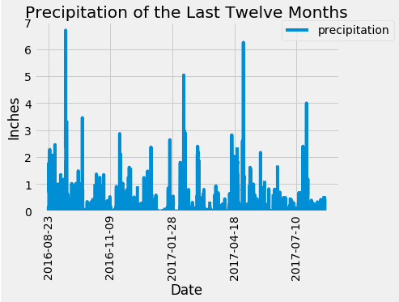
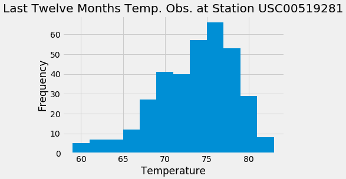
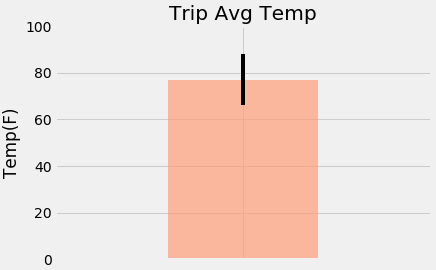

# SQLAlchemy Homework - Surfs Up!

### Background

Surfs Up! I've decided to treat myself to a long holiday vacation in Honolulu, Hawaii! I'll be spending 10 sweet days in paradise and only want the best weather while I'm there. To help with my trip planning, I need to do some climate analysis on the area. Here's what I did to make sure my trip was a success!

## Step 1 - Climate Analysis and Exploration

To begin, I used Python and SQLAlchemy to do climate analysis and data exploration of my climate database. I then used create_engine to connect to sqlite database and automap_base() to reflect my tables into classes and save a reference to those classes called `Station` and `Measurement`.
* Libraries used: SQLAlchemy ORM, Pandas, and Matplotlib.
* Data source: [hawaii.sqlite](Resources/hawaii.sqlite)
* Tool Used: [Jupyter Notebook](climate_starter.ipynb) 

### Precipitation Analysis

Here is what I did to get precipitation data:
* Design a query to retrieve the last 12 months of precipitation data.
* Select only the `date` and `prcp` values.
* Load the query results into a Pandas DataFrame and set the index to the date column.
* Sort the DataFrame values by `date`.
* Plot the results using the DataFrame `plot` method.
* Use Pandas to print the summary statistics for the precipitation data.

  
  
  

### Station Analysis

Here is what I did to get station data:
* Design a query to calculate the total number of stations.
* Design a query to find the most active stations.
* List the stations and observation counts in descending order.
* Which station has the highest number of observations?
* Design a query to retrieve the last 12 months of temperature observation data (TOBS).
* Filter by the station with the highest number of observations.
* Plot the results as a histogram with `bins=12`.

    

- - -

## Additional Analysis

* What I've found out so far is great but I wanted to look into some more information!

### Temperature Analysis II

My goals for this analysis were:
* The starter notebook contains a function called `calc_temps` that will accept a start date and end date in the format `%Y-%m-%d`. The function will return the minimum, average, and maximum temperatures for that range of dates.
* Use the `calc_temps` function to calculate the min, avg, and max temperatures for your trip using the matching dates from the previous year (i.e., use "2017-01-01" if your trip start date was "2018-01-01").
* Plot the min, avg, and max temperature from your previous query as a bar chart.
* Use the average temperature as the bar height.
* Use the peak-to-peak (TMAX-TMIN) value as the y error bar (YERR).

    

### Daily Rainfall Average

My goals for this analysis were:
* Calculate the rainfall per weather station using the previous year's matching dates.
* Calculate the daily normals. Normals are the averages for the min, avg, and max temperatures.
* Used the function provided called `daily_normals` that will calculate the daily normals for a specific date. This date string was in the format `%m-%d`. All the historic TOBS was used that match that date string.
* Create a list of dates was created for my trip in the format `%m-%d`. Used the `daily_normals` function to calculate the normals for each date string and append the results to a list.
* Use daily normals and save it into a Pandas DataFrame and set the index equal to the date.
* Use Pandas to plot an area plot (`stacked=False`) for the daily normals.

  

### Copyright

Trilogy Education Services © 2019. All Rights Reserved.
